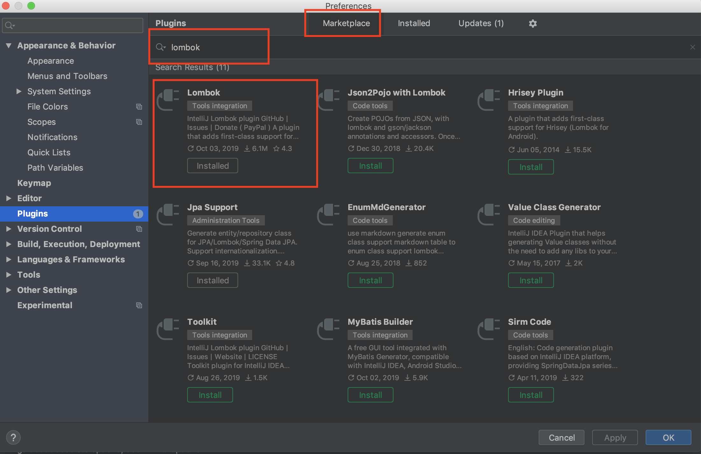

# Lombok là gì?
Lombok là một thư viện của Java giúp chúng ta giảm thiểu các đoạn code thừa bằng cách tự động sinh ra các hàm Getter/Setter
hàm khởi tạo, toString...

# Cài đặt lombok plugin trên IntelliJ IDEA

1. Vào File > Setting > Plugins
2. Search: "Lombok" ở phần Marketplace
3. Chọn Lombok Plugin và nhấn Install (Ở đây mình đã cài nên sẽ hiển thị là Installed)

4. Ấn Apply
5. Restart IDE sau đó chúng ta enable và config cho Lombok.
 - File > Setting > Other Setting > Lombok Plugin > Enable Lombok plugin for this project > Apply
 - File > Setting > Build, Execution, Deployment > Complier > Annotation Processors > Apply